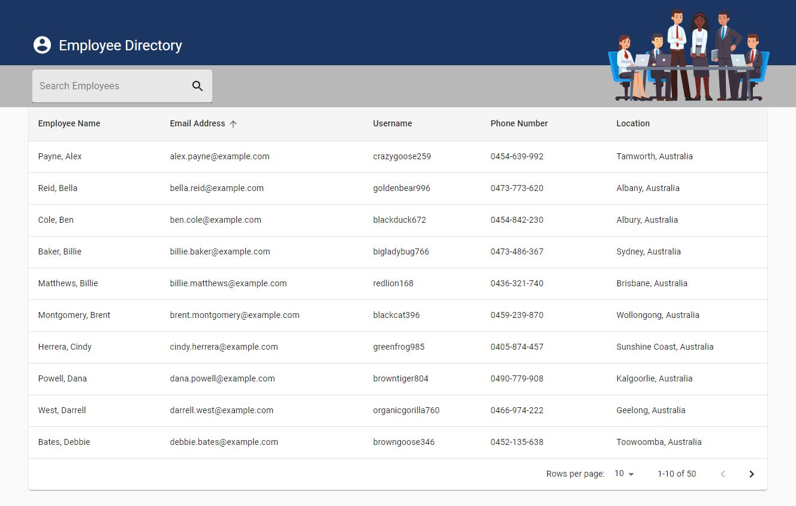

# Employee Directory

[](https://www.gnu.org/licenses/gpl-3.0)
## Description 
  For this project, we needed to create a working Employee Directory using React JS. The project required to be broken up into components, using component state and responding to user events. They should be able to sort by table headers and filter by employee name. I also included Material UI for the styling.

  ```
  As a user, I want to be able to view my entire employee directory at once so that I have quick access to their information.

  An employee or manager would benefit greatly from being able to view non-sensitive data about other employees. It would be particularly helpful to be able to filter employees by name.
  ```


 <br>

 <br>


  ---
  ## Deployed Application 
  https://diemrbond.github.io/EmployeeDirectory/
    

  ---
  ## Table of Contents

  * [Installation](#installation)
  * [Usage](#usage)
  * [License](#license)
  * [Questions](#questions)


  ---
  ## Installation 
  1. `git clone https://github.com/diemrbond/EmployeeDirectory`
  2. `npm install`


  
  ---
  ## Usage 
  1. `npm start`


  ---
  ## License 
  This application is licensed under: GNU GPLv3
  
This program is free software: you can redistribute it and/or modify it under the terms of the GNU General Public License as published by the Free Software Foundation, either version 3 of the License, or (at your option) any later version.

This program is distributed in the hope that it will be useful, but WITHOUT ANY WARRANTY; without even the implied warranty of MERCHANTABILITY or FITNESS FOR A PARTICULAR PURPOSE. See the GNU General Public License for more details.

You should have received a copy of the GNU General Public License along with this program. If not, see <https://www.gnu.org/licenses/>.


  
  ---
  ## Questions
  If you have any questions about this project, please feel free to contact me via the following information:

  

  Andrew Kelleher

  Github: https://github.com/diemrbond

  Email: [mrbondmustdie@gmail.com](mailto:mrbondmustdie@gmail.com)

  ---
  © 2020 Andrew Kelleher | https://diemrbond.github.io 
